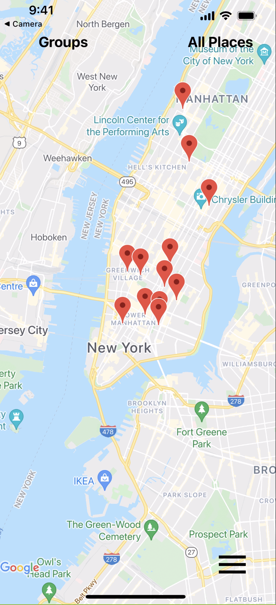
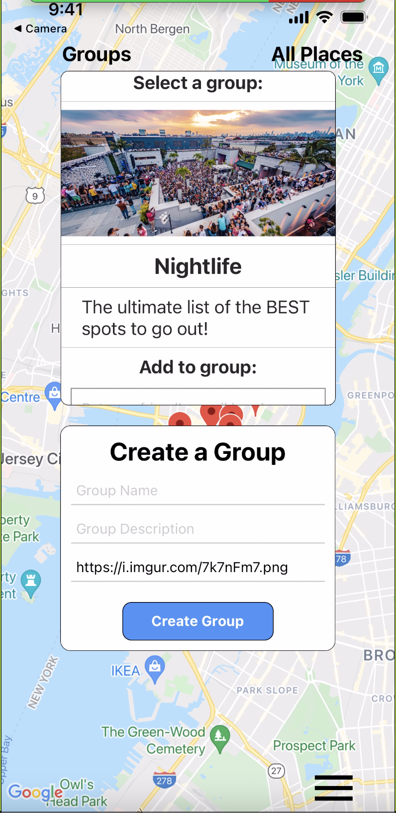
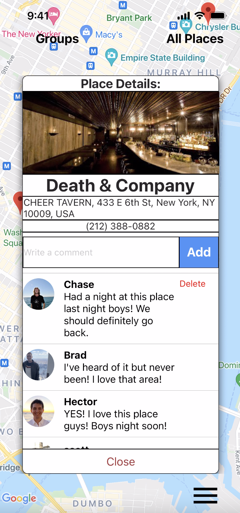
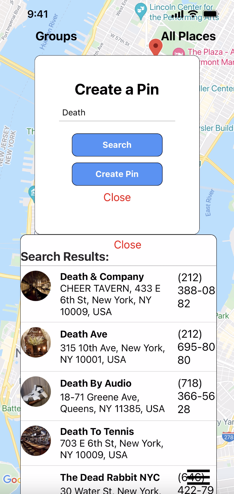
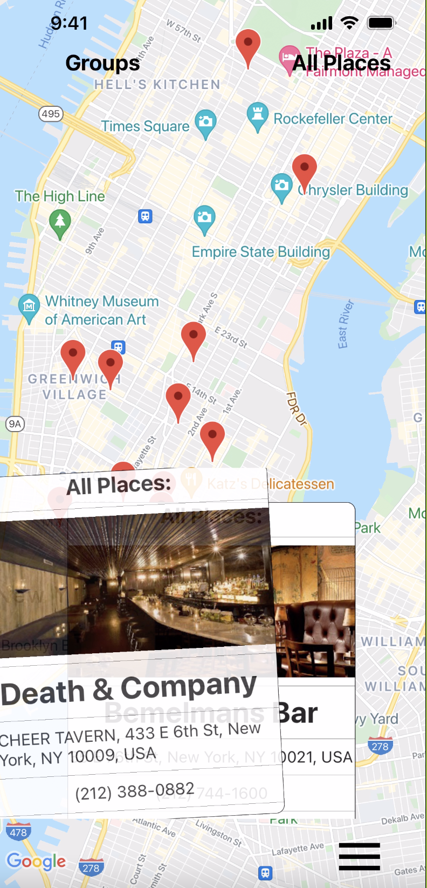

# Our City

Welcome to Our City!

**This was our 3 week long, capstone final project, for a 17 week long immersive bootcamp at Fullstack Academy.<link>https://www.fullstackacademy.com/</link>
We challenged ourselves to learn and use a new framework on this project and had a blast making it.**

Our City is a mobile, React Native, social networking application. It uses Google Places APIs to render and drop markers between groups of connected users on a shared map, generated by Google maps.

 

Users can add a new location, create a group of your closest friends, discuss the quality of a venue, restaraunt, park, or any other location your heart desires!

 In this walk through, a user selects the nightlife group, and a marker for the bar "Death & Company".

To create a marker, a user simply taps on the screen near where they think the location is, and search. The search bar uses google places autocomplete API to return a list of search results, consisting of location data, from Google maps.

A user can then select the desired place/location from the list of search results. They can then, create the marker. The marker will be shared with the rest of the group and serve as a shared review board of the location, where users can comment and share experiences.

Users can easily change groups or locations by swiping with our user friendly carousels.

Data is stored in a postgreSQL relational database, hosted on heroku.

#

# To use this app:
## 1. Copy and clone this directory.
## 2. Create an ".env" file in your root directory & add the following: : API_KEY='your api key'
## 3. Run "npm start" in the terminal.
## 4. Scan bar code with Iphone through the expo application popup.

